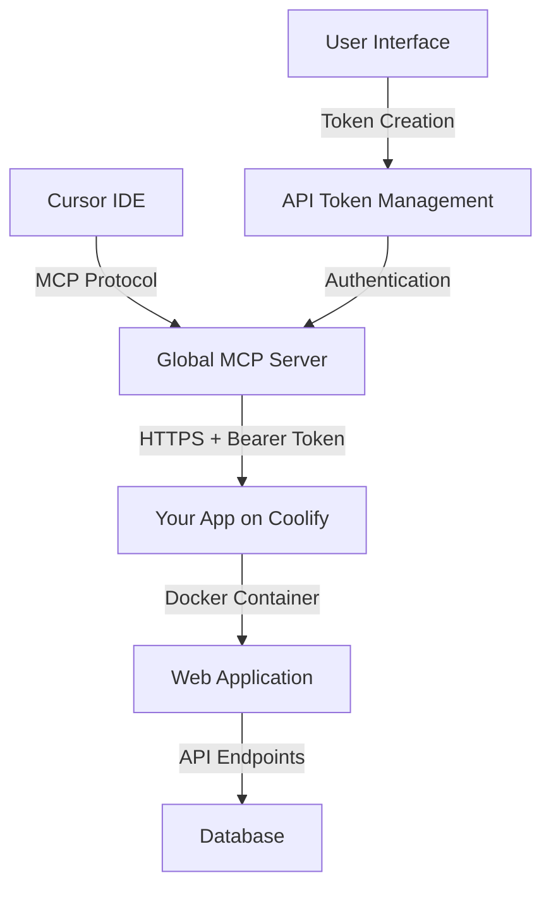

# General MCP Integration Guide for Coolify + Docker Apps

## 🎯 Universal Guide for Adding AI Integration to Any Web Application

This guide provides a **reusable template** for adding Model Context Protocol (MCP) server integration to any web application deployed on Coolify with Docker, enabling Cursor IDE to interact with your app using natural language commands.

---

## 📋 Prerequisites for Any App

- ✅ Web application deployed on Coolify
- ✅ Docker container running successfully
- ✅ Database (MySQL/PostgreSQL/SQLite) accessible
- ✅ REST API endpoints available
- ✅ User authentication system in place
- ✅ Node.js 18+ for MCP server development

---

## 🏗️ Universal Architecture Pattern



**Key Components:**
1. **MCP Server**: TypeScript/JavaScript server implementing MCP protocol
2. **API Tokens**: Secure authentication for external access
3. **API Endpoints**: RESTful endpoints for data access
4. **Authentication Middleware**: Bearer token validation
5. **User Interface**: Token management and configuration

---

## 🚀 Step-by-Step Implementation

### Phase 1: Database Setup (15 minutes)

#### 1.1 Add API Token Model

```sql
-- Add to your database schema
CREATE TABLE api_tokens (
    id VARCHAR(36) PRIMARY KEY,
    user_id VARCHAR(36) NOT NULL,
    name VARCHAR(100) NOT NULL,
    description TEXT,
    token VARCHAR(64) NOT NULL UNIQUE,
    permissions JSON DEFAULT ('["read", "write"]'),
    is_active BOOLEAN DEFAULT TRUE,
    expires_at DATETIME NULL,
    last_used_at DATETIME NULL,
    created_at DATETIME DEFAULT CURRENT_TIMESTAMP,
    updated_at DATETIME DEFAULT CURRENT_TIMESTAMP ON UPDATE CURRENT_TIMESTAMP,
    FOREIGN KEY (user_id) REFERENCES users(id) ON DELETE CASCADE
);
```

#### 1.2 ORM Model (Example for SQLAlchemy)

```python
class ApiToken(Base):
    __tablename__ = "api_tokens"
    
    id = Column(VARCHAR(36), primary_key=True, default=lambda: str(uuid.uuid4()))
    user_id = Column(VARCHAR(36), ForeignKey("users.id"), nullable=False)
    name = Column(String(100), nullable=False)
    description = Column(Text)
    token = Column(VARCHAR(64), nullable=False, unique=True)
    permissions = Column(JSON, default=lambda: ["read", "write"])
    is_active = Column(Boolean, default=True)
    expires_at = Column(DateTime, nullable=True)
    last_used_at = Column(DateTime, nullable=True)
    created_at = Column(DateTime, server_default=func.current_timestamp())
    updated_at = Column(DateTime, server_default=func.current_timestamp(), onupdate=func.current_timestamp())
    
    user = relationship("User", back_populates="api_tokens")
```

### Phase 2: Backend API Implementation (30 minutes)

#### 2.1 Authentication Middleware

```python
@app.middleware("http")
async def api_auth_middleware(request: Request, call_next):
    """Universal API token authentication middleware"""
    skip_auth_paths = [
        "/api/auth/", "/health", "/debug/", "/docs", "/openapi.json"
    ]
    
    if request.url.path.startswith("/api/") and not any(request.url.path.startswith(path) for path in skip_auth_paths):
        auth_header = request.headers.get("authorization")
        
        if auth_header and auth_header.startswith("Bearer "):
            token = auth_header.replace("Bearer ", "")
            
            db = SessionLocal()
            try:
                api_token = db.query(ApiToken).filter(
                    ApiToken.token == token,
                    ApiToken.is_active == True
                ).first()
                
                if api_token:
                    # Check expiration
                    if api_token.expires_at and datetime.utcnow() > api_token.expires_at:
                        return JSONResponse({"error": "Token expired"}, status_code=401)
                    
                    # Update last used
                    api_token.last_used_at = datetime.utcnow()
                    db.commit()
                    
                    # Set user in request state
                    user = db.query(User).filter(User.id == api_token.user_id).first()
                    if user:
                        request.state.user = user
                    else:
                        return JSONResponse({"error": "User not found"}, status_code=401)
                else:
                    return JSONResponse({"error": "Invalid token"}, status_code=401)
            finally:
                db.close()
        else:
            return JSONResponse({"error": "Authorization required"}, status_code=401)
    
    response = await call_next(request)
    return response
```

#### 2.2 Core API Endpoints (Customize for Your App)

```python
# Token Management
@app.post("/api/tokens")
async def create_api_token(request: CreateApiTokenRequest, user: User = Depends(require_auth)):
    token = secrets.token_urlsafe(32)
    # ... implementation

@app.get("/api/tokens")
async def get_api_tokens(user: User = Depends(require_auth)):
    # ... implementation

@app.delete("/api/tokens/{token_id}")
async def delete_api_token(token_id: str, user: User = Depends(require_auth)):
    # ... implementation

# Core App Data (Customize these for your specific app)
@app.get("/api/data")  # Replace with your main data endpoint
async def get_app_data(user: User = Depends(require_auth)):
    # Return your app's main data structure
    pass

@app.get("/api/items")  # Replace with your items/entities
async def get_items(user: User = Depends(require_auth)):
    # Return user's items/entities
    pass

@app.post("/api/items")  # Replace with your creation endpoint
async def create_item(request: CreateItemRequest, user: User = Depends(require_auth)):
    # Create new items/entities
    pass
```

#### 2.3 Enhanced Authentication Function

```python
def require_auth(request: Request, db: Session = Depends(get_db)) -> User:
    """Universal auth function supporting both session and API tokens"""
    # Check API token first (set by middleware)
    if hasattr(request.state, 'user') and request.state.user:
        return request.state.user
    
    # Fallback to session-based auth
    user = get_current_user(request, db)
    if not user:
        raise HTTPException(status_code=401, detail="Authentication required")
    return user
```

### Phase 3: MCP Server Development (45 minutes)

#### 3.1 Project Structure

```
your-app/
├── mcp-server/
│   ├── src/
│   │   └── index.ts
│   ├── package.json
│   ├── tsconfig.json
│   └── README.md
├── your-app-mcp-config.json
└── install-mcp.sh
```

#### 3.2 MCP Server Template (`mcp-server/src/index.ts`)

```typescript
import { Server } from '@modelcontextprotocol/sdk/server/index.js';
import { StdioServerTransport } from '@modelcontextprotocol/sdk/server/stdio.js';
import { CallToolRequestSchema, ListToolsRequestSchema } from '@modelcontextprotocol/sdk/types.js';
import axios from 'axios';

class YourAppMCPServer {
  private server: Server;
  private apiUrl: string;
  private accessToken: string;

  constructor() {
    this.server = new Server(
      {
        name: 'your-app-mcp',
        version: '1.0.0',
      },
      {
        capabilities: {
          tools: {},
        },
      }
    );

    this.apiUrl = process.env.YOUR_APP_API_URL || 'https://your-domain.com';
    this.accessToken = process.env.YOUR_APP_ACCESS_TOKEN || '';

    this.setupToolHandlers();
  }

  private async makeApiCall(endpoint: string, method = 'GET', data?: any) {
    try {
      const response = await axios({
        method,
        url: `${this.apiUrl}${endpoint}`,
        headers: {
          'Authorization': `Bearer ${this.accessToken}`,
          'Content-Type': 'application/json',
        },
        data,
      });
      return response.data;
    } catch (error: any) {
      console.error('API call failed:', error.response?.data || error.message);
      throw error;
    }
  }

  private setupToolHandlers() {
    // List available tools
    this.server.setRequestHandler(ListToolsRequestSchema, async () => {
      return {
        tools: [
          {
            name: 'get_data_list',
            description: 'Get list of your app data',
            inputSchema: {
              type: 'object',
              properties: {
                include_details: {
                  type: 'boolean',
                  description: 'Include detailed information',
                  default: true
                }
              }
            }
          },
          {
            name: 'create_item',
            description: 'Create a new item in your app',
            inputSchema: {
              type: 'object',
              properties: {
                name: {
                  type: 'string',
                  description: 'Name of the item'
                },
                description: {
                  type: 'string',
                  description: 'Description of the item'
                }
              },
              required: ['name']
            }
          },
          // Add more tools based on your app's functionality
        ],
      };
    });

    // Handle tool calls
    this.server.setRequestHandler(CallToolRequestSchema, async (request) => {
      switch (request.params.name) {
        case 'get_data_list':
          return await this.handleGetDataList(request.params.arguments);
        case 'create_item':
          return await this.handleCreateItem(request.params.arguments);
        default:
          throw new Error(`Unknown tool: ${request.params.name}`);
      }
    });
  }

  private async handleGetDataList(args: any) {
    try {
      const data = await this.makeApiCall('/api/data');
      
      const summary = `📊 **Your App Data Overview**\n\n` +
        `Found ${data.items?.length || 0} items:\n\n`;
      
      let resultsText = summary;
      
      // Format the data for display
      if (data.items && data.items.length > 0) {
        resultsText += data.items.map((item: any, index: number) => {
          return `**${index + 1}. ${item.name}**\n` +
            `   ID: ${item.id}\n` +
            `   Description: ${item.description || 'No description'}\n` +
            `   Created: ${new Date(item.created_at).toLocaleDateString()}\n`;
        }).join('\n');
      } else {
        resultsText += `No items found. Create your first item to get started!`;
      }
      
      return {
        content: [
          {
            type: 'text',
            text: resultsText
          }
        ]
      };
    } catch (error: any) {
      return {
        content: [
          {
            type: 'text',
            text: `❌ Failed to get data: ${error.response?.data?.detail || error.message}`
          }
        ]
      };
    }
  }

  private async handleCreateItem(args: any) {
    try {
      const result = await this.makeApiCall('/api/items', 'POST', {
        name: args.name,
        description: args.description || ''
      });
      
      return {
        content: [
          {
            type: 'text',
            text: `✅ Successfully created item: ${args.name}\nID: ${result.id || 'Generated'}`
          }
        ]
      };
    } catch (error: any) {
      return {
        content: [
          {
            type: 'text',
            text: `❌ Failed to create item: ${error.response?.data?.detail || error.message}`
          }
        ]
      };
    }
  }

  async run() {
    const transport = new StdioServerTransport();
    await this.server.connect(transport);
    console.error('Your App MCP server running on stdio');
  }
}

const server = new YourAppMCPServer();
server.run().catch(console.error);
```

#### 3.3 Package.json Template

```json
{
  "name": "your-app-mcp",
  "version": "1.0.0",
  "description": "MCP Server for Your App - AI integration via Model Context Protocol",
  "main": "dist/index.js",
  "bin": {
    "your-app-mcp": "dist/index.js"
  },
  "files": [
    "dist/**/*",
    "README.md",
    "package.json"
  ],
  "scripts": {
    "build": "tsc",
    "dev": "tsc --watch",
    "start": "node dist/index.js",
    "test": "jest",
    "prepublishOnly": "npm run build"
  },
  "dependencies": {
    "@modelcontextprotocol/sdk": "^0.5.0",
    "axios": "^1.6.0",
    "dotenv": "^16.3.1"
  },
  "devDependencies": {
    "@types/node": "^20.8.0",
    "typescript": "^5.2.0"
  },
  "keywords": [
    "mcp",
    "model-context-protocol",
    "your-app-domain",
    "cursor",
    "ai-integration"
  ],
  "author": "Your Name",
  "license": "MIT"
}
```

### Phase 4: Frontend Token Management (30 minutes)

#### 4.1 Token Management Page Template

```html
<!-- tokens.html -->
<!DOCTYPE html>
<html lang="en">
<head>
    <meta charset="UTF-8">
    <meta name="viewport" content="width=device-width, initial-scale=1.0">
    <title>API Tokens - Your App</title>
    <script src="https://cdn.tailwindcss.com"></script>
    <link href="https://cdnjs.cloudflare.com/ajax/libs/font-awesome/6.0.0/css/all.min.css" rel="stylesheet">
    <script src="https://unpkg.com/alpinejs@3.x.x/dist/cdn.min.js" defer></script>
</head>
<body class="bg-gray-50">
    <!-- Include your navigation -->
    
    <div class="container mx-auto px-4 py-8">
        <div class="mb-8">
            <h1 class="text-3xl font-bold text-gray-900 mb-2">
                <i class="fas fa-key text-blue-600 mr-3"></i>API Tokens
            </h1>
            <p class="text-gray-600">Manage API tokens for MCP server integration with Cursor and other AI tools.</p>
        </div>

        <!-- Token Creation Form -->
        <div class="bg-white rounded-lg shadow-md p-6 mb-8" x-data="tokenManager()">
            <h2 class="text-xl font-semibold text-gray-900 mb-4">
                <i class="fas fa-plus text-green-600 mr-2"></i>Create New Token
            </h2>
            
            <form @submit.prevent="createToken()" class="space-y-4">
                <div class="grid grid-cols-1 md:grid-cols-2 gap-4">
                    <div>
                        <label class="block text-sm font-medium text-gray-700 mb-2">Token Name</label>
                        <input type="text" x-model="newToken.name" placeholder="e.g., Cursor MCP Token" required
                               class="w-full px-3 py-2 border border-gray-300 rounded-md focus:outline-none focus:ring-2 focus:ring-blue-500">
                    </div>
                    <div>
                        <label class="block text-sm font-medium text-gray-700 mb-2">Expires In (Days)</label>
                        <select x-model="newToken.expires_in_days" 
                                class="w-full px-3 py-2 border border-gray-300 rounded-md focus:outline-none focus:ring-2 focus:ring-blue-500">
                            <option value="">Never expires</option>
                            <option value="30">30 days</option>
                            <option value="90">90 days</option>
                            <option value="365">1 year</option>
                        </select>
                    </div>
                </div>
                
                <div>
                    <label class="block text-sm font-medium text-gray-700 mb-2">Description</label>
                    <textarea x-model="newToken.description" placeholder="e.g., Token for Cursor MCP integration" rows="2"
                              class="w-full px-3 py-2 border border-gray-300 rounded-md focus:outline-none focus:ring-2 focus:ring-blue-500"></textarea>
                </div>

                <button type="submit" :disabled="loading"
                        class="bg-blue-600 hover:bg-blue-700 text-white px-6 py-2 rounded-md font-medium disabled:opacity-50">
                    <i class="fas fa-plus mr-2"></i>
                    <span x-text="loading ? 'Creating...' : 'Create Token'"></span>
                </button>
            </form>
            
            <!-- Success Banner -->
            <div x-show="createdToken && createdToken.success" x-cloak class="bg-green-50 border border-green-200 rounded-lg p-6 mt-6">
                <div class="flex items-start">
                    <i class="fas fa-check-circle text-green-400 text-xl mr-3 mt-1"></i>
                    <div class="flex-1">
                        <h3 class="text-lg font-medium text-green-800">Token Created Successfully!</h3>
                        <p class="text-green-700 mt-1">Save this token - it won't be shown again.</p>
                        
                        <!-- Token Display -->
                        <div class="mt-4 p-3 bg-white border border-green-200 rounded">
                            <div class="flex items-center justify-between">
                                <code class="text-sm font-mono break-all" x-text="createdToken?.token"></code>
                                <button @click="copyToClipboard(createdToken?.token)" 
                                        class="ml-2 bg-green-500 text-white px-3 py-1 rounded text-sm hover:bg-green-600">
                                    <i class="fas fa-copy"></i>
                                </button>
                            </div>
                        </div>
                        
                        <!-- MCP Configuration -->
                        <div class="mt-4">
                            <h4 class="font-medium text-green-800 mb-3">🔗 Cursor MCP Setup:</h4>
                            <div class="bg-gray-900 text-green-400 p-3 rounded text-xs font-mono overflow-x-auto">
                                <pre x-text="JSON.stringify(createdToken?.mcp_config, null, 2)"></pre>
                            </div>
                            <button @click="copyToClipboard(JSON.stringify(createdToken?.mcp_config, null, 2))" 
                                    class="mt-2 bg-green-500 text-white px-3 py-1 rounded text-xs hover:bg-green-600">
                                Copy Configuration
                            </button>
                        </div>
                    </div>
                </div>
            </div>
        </div>

        <!-- Existing Tokens -->
        <div class="bg-white rounded-lg shadow-md p-6">
            <h2 class="text-xl font-semibold text-gray-900 mb-4">
                <i class="fas fa-list text-blue-600 mr-2"></i>Existing Tokens
            </h2>
            <!-- Token list implementation -->
        </div>
    </div>

    <script>
        function tokenManager() {
            return {
                loading: false,
                createdToken: null,
                newToken: {
                    name: '',
                    description: '',
                    permissions: ['read', 'write'],
                    expires_in_days: null
                },

                async createToken() {
                    this.loading = true;
                    try {
                        const response = await fetch('/api/tokens', {
                            method: 'POST',
                            headers: { 'Content-Type': 'application/json' },
                            body: JSON.stringify(this.newToken)
                        });

                        const data = await response.json();
                        
                        if (data.success) {
                            this.createdToken = data;
                            this.resetForm();
                        } else {
                            alert('Error: ' + (data.detail || 'Failed to create token'));
                        }
                    } catch (error) {
                        alert('Error: ' + error.message);
                    } finally {
                        this.loading = false;
                    }
                },

                resetForm() {
                    this.newToken = {
                        name: '',
                        description: '',
                        permissions: ['read', 'write'],
                        expires_in_days: null
                    };
                },

                async copyToClipboard(text) {
                    try {
                        await navigator.clipboard.writeText(text);
                        // Show success feedback
                        const toast = document.createElement('div');
                        toast.className = 'fixed top-4 right-4 bg-green-500 text-white px-4 py-2 rounded-md z-50';
                        toast.innerHTML = '<i class="fas fa-check mr-2"></i>Copied to clipboard!';
                        document.body.appendChild(toast);
                        setTimeout(() => toast.remove(), 2000);
                    } catch (err) {
                        console.error('Failed to copy: ', err);
                    }
                }
            }
        }
    </script>
</body>
</html>
```

### Phase 5: Installation & Configuration (20 minutes)

#### 5.1 Installation Script Template (`install-mcp.sh`)

```bash
#!/bin/bash

echo "🚀 Your App - MCP Server Installation"
echo "===================================="

# Check Node.js
if ! command -v node &> /dev/null; then
    echo "❌ Node.js not found. Please install Node.js 18+"
    exit 1
fi

# Install MCP server
echo "📦 Installing MCP server globally..."
npm install -g your-app-mcp

# Verify installation
if command -v your-app-mcp &> /dev/null; then
    echo "✅ MCP Server installed successfully!"
    echo ""
    echo "📋 Next Steps:"
    echo "1. Create API token at: https://your-domain.com/tokens"
    echo "2. Configure Cursor MCP settings"
    echo "3. Restart Cursor"
    echo "4. Test with: 'Show me my data'"
else
    echo "❌ Installation failed"
    exit 1
fi
```

#### 5.2 MCP Configuration Template

```json
{
  "mcpServers": {
    "your-app": {
      "command": "your-app-mcp",
      "env": {
        "YOUR_APP_API_URL": "https://your-domain.com",
        "YOUR_APP_ACCESS_TOKEN": "{{USER_ACCESS_TOKEN}}"
      }
    }
  }
}
```

---

## 🚀 Deployment Checklist

### Pre-Deployment (Development)
- [ ] Database schema updated with api_tokens table
- [ ] API endpoints implemented and tested
- [ ] Authentication middleware added
- [ ] MCP server built and tested locally
- [ ] Token management UI created

### Coolify Deployment
- [ ] Docker image rebuilt with new code
- [ ] Environment variables configured
- [ ] Database migrations applied
- [ ] Health checks passing
- [ ] API endpoints accessible

### Post-Deployment (Production)
- [ ] Create test API token
- [ ] Verify token authentication works
- [ ] Test MCP server installation
- [ ] Configure Cursor MCP settings
- [ ] Test natural language commands
- [ ] Document setup process for users

---

## 🔧 Customization Guide

### For Different App Types

#### E-commerce App
```typescript
// Tools: get_products, create_order, get_customers, update_inventory
{
  name: 'get_products',
  description: 'Get product catalog',
  // ...
}
```

#### CRM App
```typescript
// Tools: get_contacts, create_lead, get_deals, update_contact
{
  name: 'get_contacts', 
  description: 'Get contact list',
  // ...
}
```

#### Content Management
```typescript
// Tools: get_posts, create_article, get_pages, update_content
{
  name: 'get_posts',
  description: 'Get blog posts',
  // ...
}
```

#### Project Management
```typescript
// Tools: get_projects, create_task, get_team, update_status
{
  name: 'get_projects',
  description: 'Get project list',
  // ...
}
```

### API Endpoint Patterns

```python
# Standard CRUD pattern for any entity
@app.get("/api/{entities}")           # List entities
@app.get("/api/{entities}/{id}")      # Get specific entity
@app.post("/api/{entities}")          # Create entity
@app.put("/api/{entities}/{id}")      # Update entity
@app.delete("/api/{entities}/{id}")   # Delete entity

# Dashboard/summary endpoints
@app.get("/api/dashboard/summary")    # Overview data
@app.get("/api/stats")               # Statistics
@app.get("/api/recent")              # Recent activity
```

---

## 📊 Testing & Validation

### Automated Testing Script

```python
#!/usr/bin/env python3
import requests
import json

def test_mcp_integration(api_url, token):
    """Test MCP integration for any app"""
    headers = {"Authorization": f"Bearer {token}"}
    
    tests = [
        ("Health Check", "GET", "/health", None),
        ("Token Validation", "GET", "/debug/test-tokens", None),
        ("Data Access", "GET", "/api/data", None),
        ("Items List", "GET", "/api/items", None),
    ]
    
    print("🧪 MCP Integration Test Report")
    print("=" * 40)
    
    for test_name, method, endpoint, data in tests:
        try:
            response = requests.request(method, f"{api_url}{endpoint}", 
                                      headers=headers, json=data)
            status = "✅ PASS" if response.status_code < 400 else "❌ FAIL"
            print(f"{status} {test_name}: {response.status_code}")
        except Exception as e:
            print(f"❌ FAIL {test_name}: {str(e)}")
    
    print("\n🎯 MCP Server Features Ready!")

# Usage: python test_mcp.py https://your-domain.com your_token_here
```

---

## 🔄 Maintenance & Updates

### Regular Maintenance Tasks

1. **Token Rotation** (Monthly)
   ```bash
   # Create new token, update MCP config, delete old token
   ```

2. **Security Audits** (Quarterly)
   ```bash
   # Review token usage, check for unused tokens, audit API calls
   ```

3. **Performance Monitoring** (Ongoing)
   ```bash
   # Monitor API response times, track MCP usage, optimize queries
   ```

### Update Procedures

1. **App Updates**: Redeploy Docker container
2. **MCP Server Updates**: `npm update -g your-app-mcp`
3. **Configuration Changes**: Update Cursor MCP settings
4. **New Features**: Add new tools to MCP server

---

## 📚 Best Practices

### Security
- ✅ Use HTTPS only for production
- ✅ Implement proper CORS policies
- ✅ Set token expiration dates
- ✅ Monitor API usage and rate limit
- ✅ Never log full tokens in application logs

### Performance
- ✅ Cache frequently accessed data
- ✅ Implement pagination for large datasets
- ✅ Use database indexes on token lookups
- ✅ Optimize API response sizes
- ✅ Implement request timeouts

### User Experience
- ✅ Provide clear setup instructions
- ✅ Include example commands
- ✅ Implement proper error messages
- ✅ Create troubleshooting guides
- ✅ Offer multiple authentication methods

### Development
- ✅ Use TypeScript for MCP server
- ✅ Implement comprehensive error handling
- ✅ Add proper logging and monitoring
- ✅ Create automated tests
- ✅ Document all API endpoints

---

## 🎯 Success Metrics

### Technical Metrics
- API response time < 2 seconds
- Token authentication success rate > 99%
- MCP server uptime > 99.9%
- Zero security incidents

### User Metrics
- Setup completion rate > 80%
- Daily active MCP users
- Commands per user session
- User satisfaction scores

---

## 📖 Templates & Resources

### Quick Start Templates
- [FastAPI + SQLAlchemy Template](./templates/fastapi-template/)
- [Django + PostgreSQL Template](./templates/django-template/)
- [Express.js + MongoDB Template](./templates/express-template/)
- [Flask + SQLite Template](./templates/flask-template/)

### MCP Server Templates
- [Basic CRUD MCP Server](./templates/mcp-crud-template/)
- [Analytics MCP Server](./templates/mcp-analytics-template/)
- [E-commerce MCP Server](./templates/mcp-ecommerce-template/)

### Configuration Examples
- [Development Environment](./config/dev-config.json)
- [Staging Environment](./config/staging-config.json)
- [Production Environment](./config/prod-config.json)

---

## 🎉 Conclusion

This guide provides a **universal framework** for adding MCP integration to any web application deployed on Coolify with Docker. By following these patterns, you can enable AI-powered interactions with any app, allowing users to control their applications through natural language commands in Cursor IDE.

**Key Benefits:**
- 🤖 **AI-Powered UX**: Natural language interface
- 🔧 **Standardized Approach**: Reusable across projects
- 🚀 **Fast Implementation**: 2-3 hours for complete setup
- 🔒 **Enterprise Security**: Token-based authentication
- 📈 **Scalable Architecture**: Works for apps of any size

**Remember**: Adapt the API endpoints, tool definitions, and commands to match your specific application's functionality and domain.

Happy Building! 🚀
