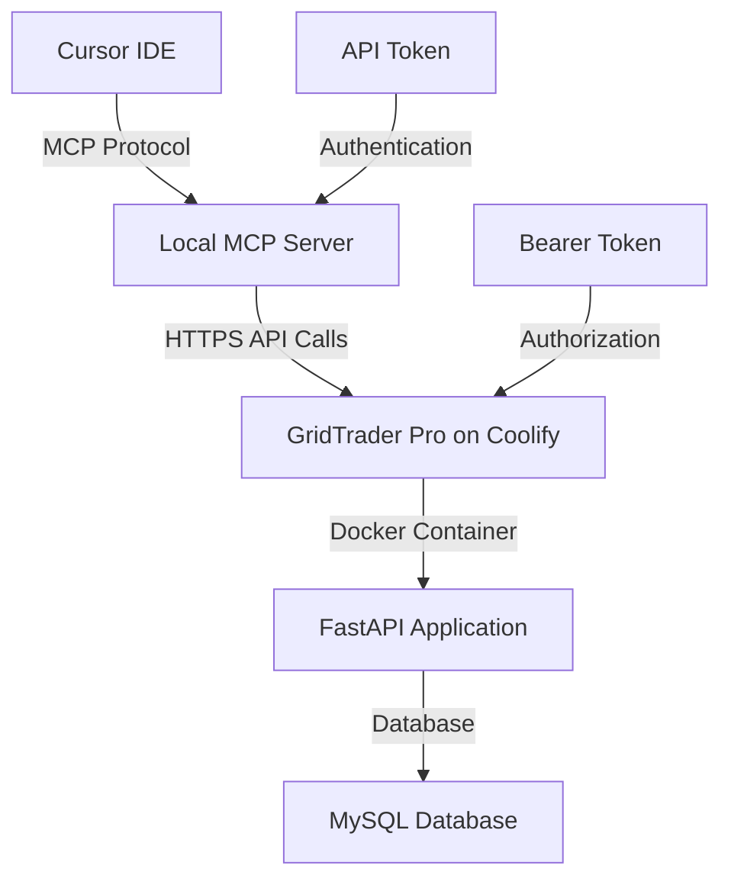

# GridTrader Pro - Global MCP Server Setup Guide

## 🚀 Complete Guide for Cursor Integration with Coolify-Deployed App

This guide provides step-by-step instructions for setting up a global MCP (Model Context Protocol) server that connects Cursor AI to your GridTrader Pro application deployed on Coolify using Docker.

---

## 📋 Prerequisites

- ✅ GridTrader Pro successfully deployed on Coolify
- ✅ Docker container running and accessible
- ✅ Node.js 18+ installed on your local machine
- ✅ Cursor IDE installed
- ✅ npm or yarn package manager

---

## 🏗️ Architecture Overview



---

## 🔧 Step 1: Install Global MCP Server

### Option A: Install from npm (Recommended)

```bash
# Install globally via npm
npm install -g gridtrader-pro-mcp

# Verify installation
gridtrader-pro-mcp --version
```

### Option B: Install from Source

```bash
# Clone the repository
git clone https://github.com/SDG223157/gridtrader-pro-webapp.git
cd gridtrader-pro-webapp/mcp-server

# Install dependencies
npm install

# Build the TypeScript code
npm run build

# Install globally
npm install -g .

# Verify installation
gridtrader-pro-mcp --version
```

---

## 🔑 Step 2: Create API Token

### 2.1 Access Token Management

1. **Open your deployed app**: `https://your-coolify-domain.com/tokens`
2. **Login** to your GridTrader Pro account
3. **Click "Create New Token"**

### 2.2 Token Configuration

```
Token Name: Cursor MCP Integration
Description: Token for Cursor AI assistant integration
Permissions: ☑️ Read ☑️ Write
Expires In: Never expires (or set as needed)
```

### 2.3 Save Token Information

After creation, you'll receive:
- **API Token**: `abc123xyz789...` (save this securely!)
- **MCP Configuration**: JSON config for Cursor
- **Installation Command**: For automated setup

⚠️ **IMPORTANT**: Save the token immediately - it won't be shown again!

---

## ⚙️ Step 3: Configure Cursor MCP Settings

### 3.1 Open Cursor MCP Settings

- **macOS**: `Cursor` → `Settings` → `MCP`
- **Windows/Linux**: `File` → `Preferences` → `MCP`

### 3.2 Add MCP Server Configuration

Add this JSON configuration to your Cursor MCP settings:

```json
{
  "mcpServers": {
    "gridtrader-pro": {
      "command": "gridtrader-pro-mcp",
      "env": {
        "GRIDTRADER_API_URL": "https://your-coolify-domain.com",
        "GRIDTRADER_ACCESS_TOKEN": "your_api_token_here"
      }
    }
  }
}
```

### 3.3 Replace Placeholders

- **`https://your-coolify-domain.com`**: Your actual Coolify domain
- **`your_api_token_here`**: The API token from Step 2

### 3.4 Example Configuration

```json
{
  "mcpServers": {
    "gridtrader-pro": {
      "command": "gridtrader-pro-mcp",
      "env": {
        "GRIDTRADER_API_URL": "https://gridsai.app",
        "GRIDTRADER_ACCESS_TOKEN": "9W7mTxybZ-RZDskaOBqZ1-Oe4DE4DW2CBAvZxrhsIWE"
      }
    }
  }
}
```

---

## 🔄 Step 4: Restart and Test

### 4.1 Restart Cursor

1. **Close Cursor completely**
2. **Reopen Cursor**
3. **Wait for MCP server to initialize** (check status bar)

### 4.2 Test Connection

Try these natural language commands in Cursor:

```
Show me all my portfolios
```

```
What's my current cash balance?
```

```
Create a growth portfolio with $25,000
```

### 4.3 Expected Response

You should see detailed portfolio information like:

```
📊 Portfolio Overview

**1. JC**
   Strategy: balanced
   Value: $10,000,000
   Cash Balance: $8,000,000
   Return: 📈 0.00%
   Created: 8/31/2025
```

---

## 🛠️ Step 5: Available MCP Commands

### Portfolio Management
- `"Show me all my portfolios"`
- `"Create a new portfolio called 'Tech Growth' with $50,000"`
- `"What's the performance of my portfolios?"`
- `"Show portfolio details for [portfolio-id]"`

### Cash & Balance Management
- `"Show me my cash balances"`
- `"What's my total cash across all portfolios?"`
- `"Update my cash balance to reflect interest earned"`

### Grid Trading
- `"Show me my active grid strategies"`
- `"Create a grid for AAPL between $150-200 with $10,000"`
- `"What's the performance of my TSLA grid?"`

### Market Data
- `"What's the current price of AAPL?"`
- `"Search for Tesla stock symbol"`
- `"Get market data for SPY"`

### Analytics & Insights
- `"Show my dashboard summary"`
- `"What are my trading alerts?"`
- `"Calculate portfolio metrics for the last month"`

---

## 🔍 Step 6: Troubleshooting

### 6.1 Common Issues

#### "MCP Server Not Found"
```bash
# Check if installed globally
npm list -g gridtrader-pro-mcp

# Reinstall if needed
npm install -g gridtrader-pro-mcp
```

#### "Authentication Failed"
- ✅ Check API token is correct
- ✅ Verify token hasn't expired
- ✅ Ensure URL is correct (https://)
- ✅ Create a new token if needed

#### "Connection Refused"
- ✅ Verify Coolify deployment is running
- ✅ Check domain accessibility
- ✅ Confirm Docker container is healthy

### 6.2 Debug Mode

Enable debug logging:

```json
{
  "mcpServers": {
    "gridtrader-pro": {
      "command": "gridtrader-pro-mcp",
      "env": {
        "GRIDTRADER_API_URL": "https://your-domain.com",
        "GRIDTRADER_ACCESS_TOKEN": "your_token",
        "DEBUG": "true"
      }
    }
  }
}
```

### 6.3 Test API Directly

```bash
# Test API connectivity
curl -H "Authorization: Bearer YOUR_TOKEN" \
     https://your-domain.com/api/portfolios

# Should return portfolio data
```

---

## 🐳 Step 7: Docker Environment Considerations

### 7.1 Coolify Environment Variables

Ensure these are set in your Coolify deployment:

```env
SECRET_KEY=your_super_secret_key_change_this_in_production
DB_HOST=your_mysql_host
DB_USER=your_mysql_user  
DB_PASSWORD=your_mysql_password
DB_NAME=gridtrader_pro
GOOGLE_CLIENT_ID=your_google_oauth_client_id
GOOGLE_CLIENT_SECRET=your_google_oauth_secret
```

### 7.2 Docker Health Checks

Your Dockerfile should include health checks:

```dockerfile
HEALTHCHECK --interval=30s --timeout=30s --start-period=5s --retries=3 \
    CMD curl -f http://localhost:8000/health || exit 1
```

### 7.3 Port Configuration

Ensure port 8000 is exposed in your Coolify service configuration.

---

## 📚 Step 8: Advanced Configuration

### 8.1 Multiple Environments

For different environments (dev, staging, prod):

```json
{
  "mcpServers": {
    "gridtrader-pro-dev": {
      "command": "gridtrader-pro-mcp",
      "env": {
        "GRIDTRADER_API_URL": "https://dev.your-domain.com",
        "GRIDTRADER_ACCESS_TOKEN": "dev_token_here"
      }
    },
    "gridtrader-pro-prod": {
      "command": "gridtrader-pro-mcp", 
      "env": {
        "GRIDTRADER_API_URL": "https://gridsai.app",
        "GRIDTRADER_ACCESS_TOKEN": "prod_token_here"
      }
    }
  }
}
```

### 8.2 Custom MCP Server Path

If installed locally instead of globally:

```json
{
  "mcpServers": {
    "gridtrader-pro": {
      "command": "node",
      "args": ["/path/to/gridtrader-pro-webapp/mcp-server/dist/index.js"],
      "env": {
        "GRIDTRADER_API_URL": "https://your-domain.com",
        "GRIDTRADER_ACCESS_TOKEN": "your_token_here"
      }
    }
  }
}
```

---

## 🔐 Step 9: Security Best Practices

### 9.1 Token Management
- ✅ Use different tokens for different environments
- ✅ Set expiration dates for tokens
- ✅ Rotate tokens regularly
- ✅ Never commit tokens to version control
- ✅ Use environment variables for sensitive data

### 9.2 Network Security
- ✅ Always use HTTPS for production
- ✅ Configure proper CORS settings
- ✅ Implement rate limiting
- ✅ Monitor API usage

### 9.3 Access Control
- ✅ Use least privilege principle for token permissions
- ✅ Monitor token usage in logs
- ✅ Revoke unused tokens
- ✅ Regular security audits

---

## 📊 Step 10: Monitoring & Maintenance

### 10.1 Health Monitoring

Check these endpoints regularly:

```bash
# App health
curl https://your-domain.com/health

# Database connectivity  
curl https://your-domain.com/debug/test-tokens-db

# Token functionality
curl https://your-domain.com/debug/test-tokens
```

### 10.2 Log Monitoring

Monitor these logs in Coolify:
- Application logs for API calls
- Authentication failures
- Database connection issues
- MCP server connection attempts

### 10.3 Performance Monitoring

Track these metrics:
- API response times
- Token usage frequency
- Database query performance
- Docker container resource usage

---

## 🎯 Step 11: Success Verification

### 11.1 Complete Test Checklist

- [ ] MCP server installed globally
- [ ] API token created and saved
- [ ] Cursor MCP configuration added
- [ ] Cursor restarted successfully
- [ ] Can execute: "Show me my portfolios"
- [ ] Can execute: "What's my cash balance?"
- [ ] Can execute: "Create a new portfolio"
- [ ] All commands return expected data

### 11.2 Integration Success Indicators

✅ **Green Status Bar**: Cursor shows MCP server as connected
✅ **Natural Language**: Commands work in plain English
✅ **Real Data**: Returns actual portfolio information
✅ **Fast Response**: Commands execute within 2-3 seconds
✅ **Error Handling**: Clear error messages when issues occur

---

## 🚀 Next Steps

Once your MCP integration is working:

1. **Explore Advanced Commands**: Try complex portfolio operations
2. **Automate Workflows**: Use AI to manage routine trading tasks  
3. **Create Custom Strategies**: Ask AI to help design trading strategies
4. **Monitor Performance**: Use AI to analyze portfolio performance
5. **Risk Management**: Get AI insights on portfolio risk

---

## 📞 Support & Resources

### Documentation
- [MCP Protocol Specification](https://modelcontextprotocol.io)
- [GridTrader Pro API Documentation](https://gridsai.app/docs)
- [Cursor MCP Setup Guide](https://cursor.sh/docs/mcp)

### Community
- GitHub Issues: [Report problems](https://github.com/SDG223157/gridtrader-pro-webapp/issues)
- Discord: Join our trading community
- Email: support@gridsai.app

### Updates
- Check for MCP server updates: `npm update -g gridtrader-pro-mcp`
- Monitor app updates through Coolify dashboard
- Subscribe to release notifications

---

## 🎉 Congratulations!

You now have a fully functional AI-powered trading assistant! Your GridTrader Pro deployment on Coolify is connected to Cursor through the MCP protocol, enabling natural language portfolio management and trading operations.

**Example Commands to Try:**
- "Show me my best performing portfolio"
- "Create a conservative portfolio for retirement with $100,000"
- "Set up dollar-cost averaging for SPY with $1,000 monthly"
- "What's my portfolio's risk exposure?"
- "Rebalance my tech portfolio based on current market conditions"

Happy Trading! 🚀📈
